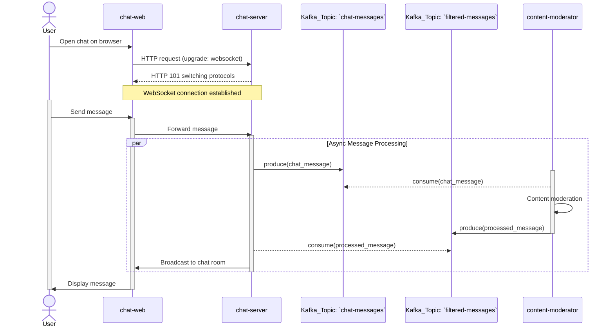

# Kafka Demo - A Chat Moderation System

https://github.com/user-attachments/assets/188c7fe0-a411-4d73-a548-75b9fc5f00c3

## Overview

A simple Kafka-based application that leverages real-time stream processing to filter chat messages.

## Prerequisites

- `Go v1.24`
- `Docker` or `Helm Chart` (choose either for deployment)

## Architecture

The chat moderation system is composed of the following components:

- `chat-server`: WebSocket server handling client connections and message routing
- `chat-web`: Frontend web interface
- `content-moderator`: Content moderation service for filtering sensitive words
- `kafka`: Event streaming platform
- `kafka-ui`: Kafka management interface



## Features

- Real-time Message Processing
- Event-Driven Microservices Architecture
- Stream-based Data Pipeline

## Quick Start

### Using Docker Compose

1. Start the services

    ```bash
    make docker-up
    ```

2. Access the application

   - Chat Interface: http://localhost:8081
   - Kafka UI: http://localhost:8080

### Using Helm Chart on Minikube

1. Build dependency

    ```bash
    make helm-setup
    make minikube-load-images
    ```

2. Install chart

    ```bash
    make helm-install
    ```

3. Port forward

    ```bash
    make port-forward
    ```

4. Access the application

   - Chat Interface: http://localhost:8081
   - Kafka UI: http://localhost:8080

**Note:** Ensure that `Minikube`, `Helm`, and `kubectl` are installed on your system.

### Project Structure

```bash
.
├── cmd             # main entry points for applications
├── docker          # docker configuration file
├── helm            # helm chart template
├── internal
│   ├── entities    # core data structures
│   └── utils       # shared utility functions
└── public          # static assets for frontend
```

## Configuration

Environment Variables:

- `KAFKA_BOOTSTRAP_SERVERS`: Kafka server address
- `WEBSOCKET_SERVER`: WebSocket server address

## Kafka Topics

- `chat-messages`: Raw chat messages
- `filtered-messages`: Moderated messages

## Notes

The system's Kafka consumer uses manual partition assignment instead of the consumer group mechanism, for the following reasons:

1. To avoid latency (several seconds) introduced by consumer group rebalancing
2. To ensure better real-time responsiveness during demo presentations
3. Since this is a demo system, horizontal scalability is not a concern, making manual assignment a simpler and more controllable choice
