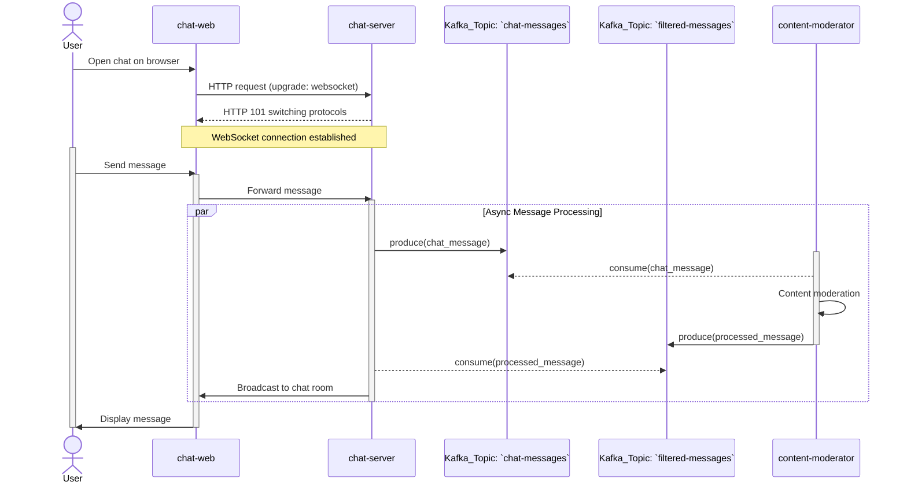

# Kafka Demo - A Chat Moderation System

## Overview

A simple Kafka application that leverages Kafka's real-time processing mechanism to filter chat messages.

## Prerequisites

- `golang v1.24`
- `docker` or `helm chart`

## Architecture

The chat moderation system consists of the following components:

- `chat-server`: WebSocket server handling client connections and message routing
- `chat-web`: Frontend web interface
- `content-moderator`: Content moderation service for filtering sensitive words
- `kafka`: Event streaming platform
- `kafka-ui`: Kafka management interface



## Features

- Real-time Processing
- Event-Driven Architecture
- Data Pipeline

## Quick Start with Docker Compose

1. Start the services

    ```bash
    make docker-up
    ```

2. Access the application

   - Chat Interface: http://localhost:8081
   - Kafka UI: http://localhost:8080

### Project Structure

```bash
.
├── cmd             # main entry points for applications
├── docker          # docker configuration file
├── internal
│   ├── entities    # core data structures
│   └── utils       # shared utility functions
└── public          # static assets for frontend
```

## Configuration

Environment Variables:

- `KAFKA_BOOTSTRAP_SERVERS`: Kafka server address
- `WEBSOCKET_SERVER`: WebSocket server address

## Kafka Topics

- `chat-messages`: Raw chat messages
- `filtered-messages`: Moderated messages
